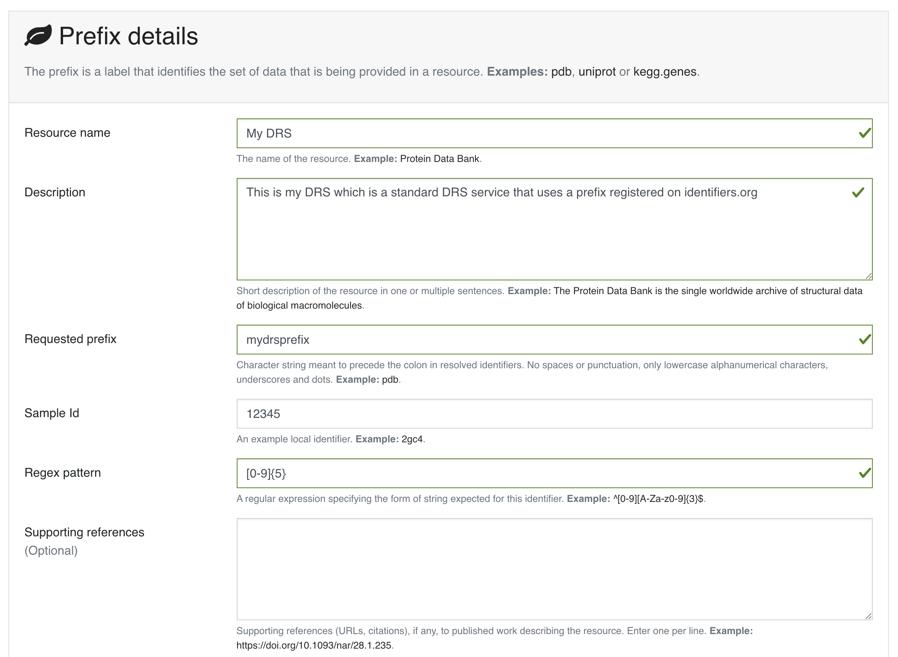
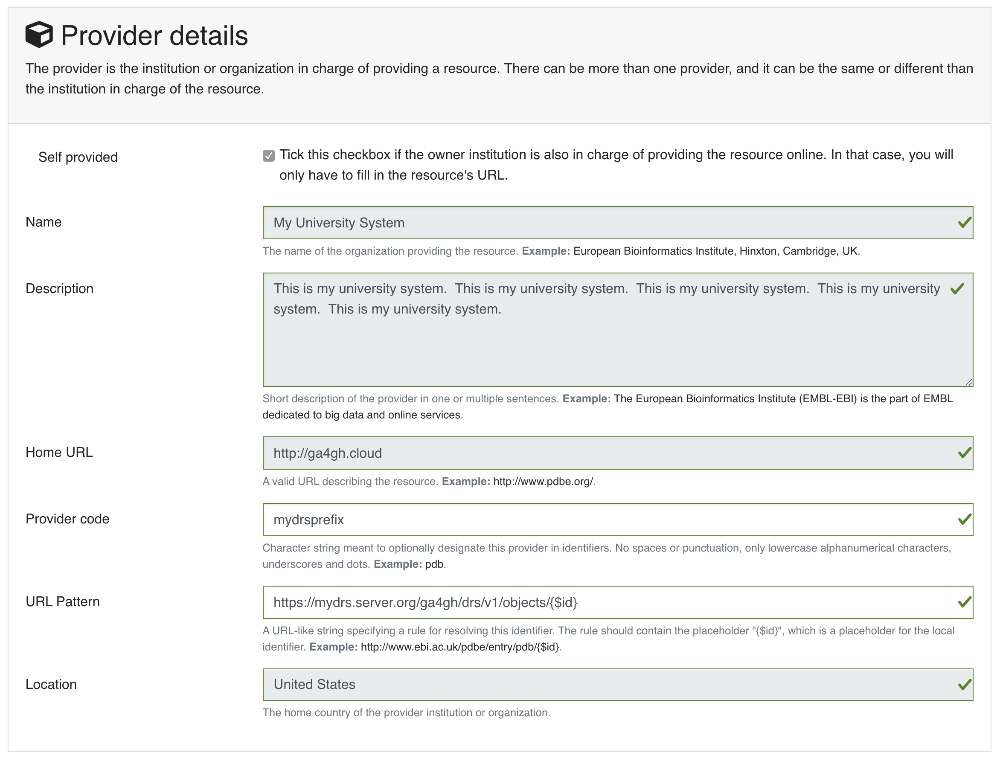

== Appendix: Motivation

[cols="40a,60a"]
|===
|Data sharing requires portable data, consistent with the FAIR data principles (findable, accessible, interoperable, reusable). Today’s researchers and clinicians are surrounded by potentially useful data, but often need bespoke tools and processes to work with each dataset. Today’s data publishers don’t have a reliable way to make their data useful to all (and only) the people they choose. And today’s data controllers are tasked with implementing standard controls of non-standard mechanisms for data access.
|image::figure1.png[]
_Figure 1: there’s an ocean of data, with many different tools to drink from it, but no guarantee that any tool will work with any subset of the data_
|===

[cols="40a,60a"]
|===
|We need a standard way for data producers to make their data available to data consumers, that supports the control needs of the former and the access needs of the latter. And we need it to be interoperable, so anyone who builds access tools and systems can be confident they'll work with all the data out there, and anyone who publishes data can be confident it will work with all the tools out there.
|image::figure2.png[]
_Figure 2: by defining a standard Data Repository API, and adapting tools to use it, every data publisher can now make their data useful to every data consumer_
|===

[cols="75a,25a"]
|===

|We envision a world where:

* there are many many **data consumers**, working in research and in care, who can use the tools of their choice to access any and all data that they have permission to see
* there are many **data access tools** and platforms, supporting discovery, visualization, analysis, and collaboration
* there are many **data repositories**, each with their own policies and characteristics, which can be accessed by a variety of tools
* there are many **data publishing tools** and platforms, supporting a variety of data lifecycles and formats
* there are many many **data producers**, generating data of all types, who can use the tools of their choice to make their data as widely available as is appropriate

|image::figure3.png[]
_Figure 3: a standard Data Repository API enables an ecosystem of data producers and consumers_
|===

This spec defines a standard **Data Repository Service (DRS) API** (“the yellow box”), to enable that ecosystem of data producers and consumers. Our goal is that the only thing data consumers need to know about a data repo is _"here's the DRS endpoint to access it"_, and the only thing data publishers need to know to tap into the world of consumption tools is _"here's how to tell it where my DRS endpoint lives"_.

=== Federation

The world's biomedical data is controlled by groups with very different policies and restrictions on where their data lives and how it can be accessed. A primary purpose of DRS is to support unified access to disparate and distributed data. (As opposed to the alternative centralized model of "let's just bring all the data into one single data repository”, which would be technically easier but is no more realistic than “let’s just bring all the websites into one single web host”.)

In a DRS-enabled world, tool builders don’t have to worry about where the data their tools operate on lives -- they can count on DRS to give them access. And tool users only need to know which DRS server is managing the data they need, and whether they have permission to access it; they don’t have to worry about how to physically get access to, or (worse) make a copy of the data. For example, if I have appropriate permissions, I can run a pooled analysis where I run a single tool across data managed by different DRS servers, potentially in different locations.

== Appendix: Background Notes on DRS URIs

=== Design Motivation

DRS URIs are aligned with the https://www.nature.com/articles/sdata201618[FAIR data principles] and the https://doi.org/10.1038/sdata.2018.2[Joint Declaration of Data Citation Principles] -- both hostname-based and compact identifier-based URIs provide globally unique, machine-resolvable, persistent identifiers for data.

* We require all URIs to begin with `drs://` as a signal to humans and  systems consuming these URIs that the response they will ultimately receive, after transforming the URI to a fetchable URL, will be a DRS JSON packet. This signal differentiates DRS URIs from the wide variety of other entities (HTML documents, PDFs, ontology notes, etc.) that can be represented by compact identifiers.
* We support hostname-based URIs because of their simplicity and efficiency for server and client implementers.
* We support compact identifier-based URIs, and the meta-resolver services of identifiers.org and n2t.net (Name-to-Thing), because of the wide adoption of compact identifiers in the research community. as detailed by https://doi.org/10.1038/sdata.2018.29[Wimalaratne et al (2018)] in "Uniform resolution of compact identifiers for biomedical data."

== Appendix: Compact Identifier-Based URIs

.Note: Identifiers.org/n2t.net Changes
****
The examples below show the current API interactions with https://n2t.net/e/compact_ids.html[n2t.net] and https://docs.identifiers.org/[identifiers.org] and these may change over time.  Please refer to the documentation from each site for the most up-to-date information.  We will make best efforts to keep the DRS specification current but DRS clients MUST maintain their ability to use either the identifiers.org or n2t.net APIs to resolve compact identifier-based DRS URIs.
****

=== Registering a DRS Server on a Meta-Resolver

See the documentation on the https://n2t.net/e/compact_ids.html[n2t.net] and https://docs.identifiers.org/[identifiers.org] meta-resolvers for adding your own compact identifier type and registering your DRS server as a resolver. You can register new prefixes (or mirrors by adding resource provider codes) for free using a simple online form.  Keep in mind, while anyone can register prefixes, the identifiers.org/n2t.net sites do basic hand curation to verify new prefix and resource (provider code) requests.  See those sites for more details on their security practices.

Starting with the prefix for our new compact identifier, let's register the namespace `mydrsprefix` on identifiers.org/n2t.net and use 5-digit numeric IDs as our accessions.  We will then link this to the DRS server at `https://mydrs.server.org/ga4gh/drs/v1/` by filling in the provider details.  Here's what that the registration for our new namespace looks like on https://registry.identifiers.org/prefixregistrationrequest[identifiers.org]:

=== Calling Meta-Resolver APIs for Compact Identifier-Based DRS URIs

Clients resolving Compact Identifier-based URIs need to convert a prefix (e.g. “drs.42”) into an URL pattern. They can do so by calling either the identifiers.org or the n2t.net API, since the two meta-resolvers keep their mapping databases in sync.

=== Calling the identifiers.org API as a Client

It takes two API calls to get the URL pattern.

(i) The client makes a GET request to identifiers.org to find information about the prefix:

  GET https://registry.api.identifiers.org/restApi/namespaces/search/findByPrefix?prefix=drs.42

This request returns a JSON structure including various URLs containing an embedded namespace id, such as:

  "namespace" : {
   "href":"https://registry.api.identifiers.org/restApi/namespaces/1234"
  }

(ii) The client extracts the namespace id (in this example 1234), and uses it to make a second GET request to identifiers.org to find information about the namespace:

  GET https://registry.api.identifiers.org/restApi/resources/search/findAllByNamespaceId?id=1234

This request returns a JSON structure including an urlPattern field, whose value is an URL pattern containing a `${id}` parameter, such as:

  "urlPattern" : "https://drs.myexample.org/ga4gh/drs/v1/objects/{$id}"

=== Calling the n2t.net API as a Client

It takes one API call to get the URL pattern.

The client makes a GET request to n2t.net to find information about the namespace. (Note the trailing colon.)

  GET https://n2t.net/drs.42:

This request returns a text structure including a redirect field, whose value is an URL pattern containing a `$id` parameter, such as:

   redirect: https://drs.myexample.org/ga4gh/drs/v1/objects/$id

=== Caching with Compact Identifiers

Identifiers.org/n2t.net compact identifier resolver records do not change frequently.  This reality is  useful for caching resolver records and their URL patterns for performance reasons.  Builders of systems that use compact identifier-based DRS URIs should cache prefix resolver records from identifiers.org/n2t.net and occasionally refresh the records (such as every 24 hours).  This approach will reduce the burden on these community services since we anticipate many DRS URIs will be regularly resolved in workflow systems.  The implementation of the caching approach is up to system builders but we recommend at least caching the mapping of prefixes to URL patterns. System builders may also choose to cache the compact identifier accession to final DRS URL records as well, but that decision/design is at the discretion of the system builder.  Alternatively, system builders may decide to directly mirror the registries themselves, instructions are provided on the identifiers.org/n2t.net websites.

=== Security with Compact Identifiers

As mentioned earlier, identifiers.org/n2t.net performs some basic verification of new prefixes and provider code mirror registrations on their sites.  However, system builders may have certain security compliance requirements and regulations that prohibit relying on an external site for resolving compact identifiers.  In this case, systems under these security and compliance constraints may wish to whitelist certain compact identifier resolvers and/or vet records from identifiers.org/n2t.net before enabling in their system.

=== Accession Encoding to Valid DRS IDs

The compact identifier format used by identifiers.org/n2t.net does not percent-encode reserved URI characters but, instead, relies on the first ":" character to separate prefix from accession. Since these accessions can contain any characters, and characters like "/" will interfere with DRS API calls, you _must_ percent encode the accessions extracted from DRS compact identifier-based URIs when using as DRS IDs in subsequent DRS GET requests.  An easy way for a DRS client to handle this is to get the initial DRS object JSON response from whatever redirects the compact identifier resolves to, then look for the `self_uri` in the JSON, which will give you the correctly percent-encoded DRS ID for subsequent DRS API calls such as the `access` method.

=== Additional Examples

For additional examples, see the document link:more_background_on_compact_identifiers.adoc[More Background on Compact Identifiers].

== Appendix: Hostname-Based URIs

=== Future DRS Versions and Service Registry/Info

In the future, as new major versions of DRS are released, a DRS server might support multiple API versions on different URL paths. At that point we expect to add support for https://github.com/ga4gh-discovery/ga4gh-service-registry[service-registry] and https://github.com/ga4gh-discovery/ga4gh-service-info[service-info] endpoints to the API, and to update the URI resolution logic to describe how to use those endpoints when translating hostname-based DRS URIs to URLs.
